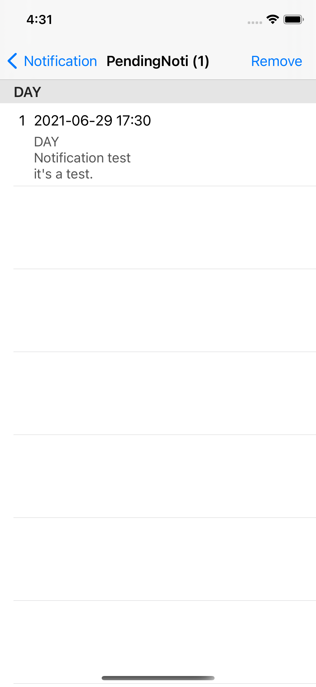
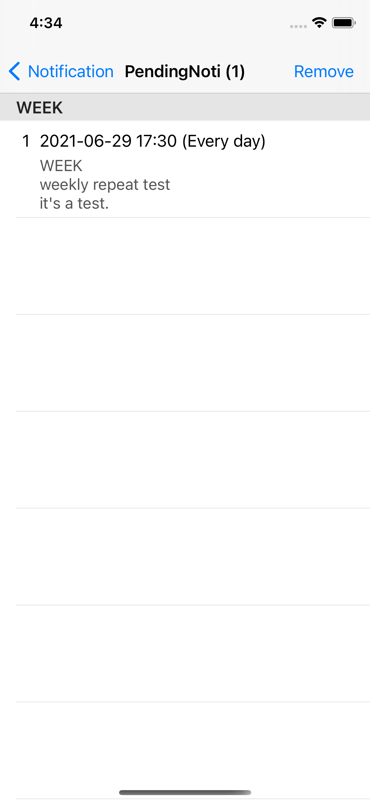
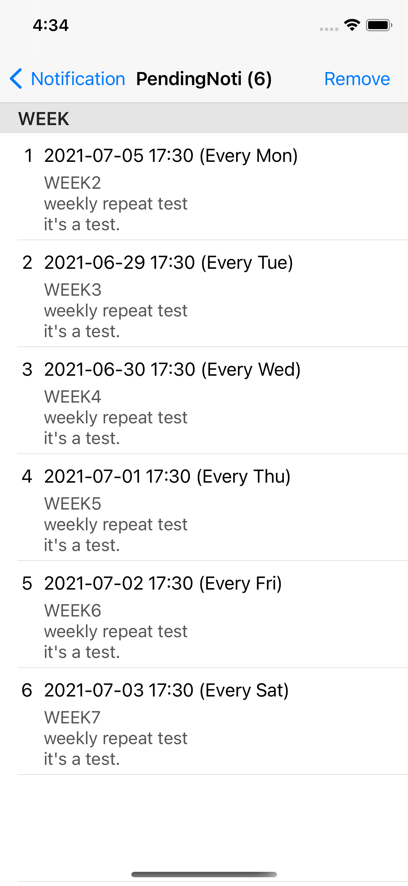
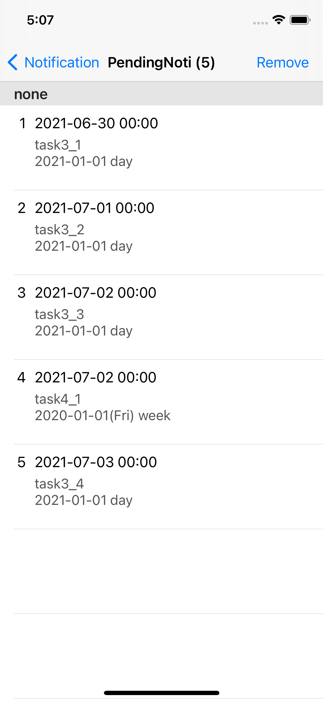

# TSUserNotifications

[](https://swift.org)
[](https://developer.apple.com/ios/)
[](https://github.com/tsleedev/TSUserNotifications/blob/master/LICENSE)
[](https://swift.org/package-manager/)

A simple and modern Swift wrapper for UNUserNotificationCenter with async/await support.

## Requirements

- iOS 13.0+
- Swift 5.7+
- Xcode 14.0+

## Installation

### Swift Package Manager

Add the following to your `Package.swift` file:

```swift
dependencies: [
    .package(url: "https://github.com/tsleedev/TSUserNotifications.git", from: "2.0.0")
]
```

Or add it through Xcode:
1. File > Add Package Dependencies
2. Enter: `https://github.com/tsleedev/TSUserNotifications.git`
3. Select version: `2.0.0` or later


## Usage

### Basic Setup

First, request notification permission:

```swift
import UserNotifications

let center = UNUserNotificationCenter.current()
let options: UNAuthorizationOptions = [.alert, .sound, .badge]
try await center.requestAuthorization(options: options)
```

### Schedule a Notification

**Specific date:**
```swift
TSUserNotificationCenter.set(
    identifier: "test",
    date: Date(),
    repeatType: .none,
    title: "test",
    subtitle: nil,
    body: "It's test.",
    badge: nil,
    sound: nil,
    userInfo: nil,
    threadIdentifier: nil
)
```


**Weekly repeat:**
```swift
TSUserNotificationCenter.setDayOfTheWeek(
    identifier: "WEEK",
    hour: 14,
    minute: 30,
    dayOfTheWeeks: [.sunday, .monday, .tuesday, .wednesday, .thursday, .friday, .saturday],
    title: "weekly repeat test",
    subtitle: nil,
    body: "It's weekly repeat test.",
    badge: nil,
    sound: nil,
    userInfo: nil,
    threadIdentifier: nil
)
```
 

### Remove Notifications (async/await)

```swift
// Remove specific identifiers
await TSUserNotificationCenter.remove(identifiers: ["test", "WEEK"])

// Remove by identifier pattern
await TSUserNotificationCenter.removeContain(identifier: "task")

// Remove all notifications
await TSUserNotificationCenter.removeAll()
```

### Automatic Calculation with Priority

```swift
let userNotifications = [
    TSUserNotification(
        identifier: "task1",
        date: Date().addingTimeInterval(-86400), // yesterday
        repeatType: .none,
        title: "Past notification (skipped)"
    ),
    TSUserNotification(
        identifier: "task2",
        date: Date().addingTimeInterval(86400 * 7), // next week
        repeatType: .none,
        title: "Future notification"
    ),
    TSUserNotification(
        identifier: "task3",
        date: Date(),
        repeatType: .day,
        title: "Daily repeat"
    ),
    TSUserNotification(
        identifier: "task4",
        date: Date(),
        repeatType: .week,
        title: "Weekly repeat"
    )
]

Task {
    await TSUserNotificationCenter.removeContain(identifier: "task")
    TSUserNotificationCenter.set(notifications: userNotifications, max: 10)
}
```

The library automatically calculates and schedules notifications based on priority and date.



## Example Project

To run the example project, clone the repo and open `Example/TSUserNotifications.xcodeproj`.

## Author

taesu, tslee.dev@gmail.com

## License

TSUserNotifications is available under the MIT license. See the LICENSE file for more info.
